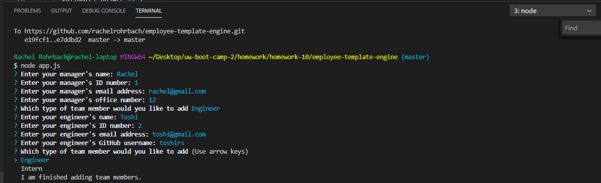
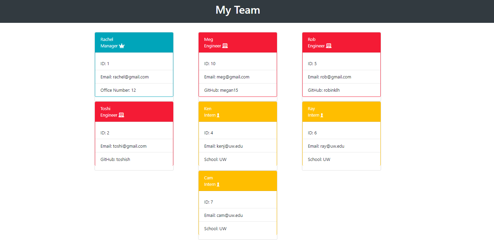

# Template Engine - Employee Summary

## Table of contents
* [General info](#general-info)
* [Technologies](#technologies)
* [Screenshots](#screenshots)
* [Credits](#credits)
* [License](#license)

## General info
This project is a command-line application that dynamically generates an html page about a software engineering team based on user provided information. First the user must use the following command to install dependencies required:
```sh
npm install
```
The application is then invoked with the following commands:
```sh
node app.js
```
The user is then prompted for information about the manager and additional team members. The user can input any number of team members, and they may be a mix of engineers and interns.
There are also unit tests included to test that the sub-classes (managers, engineers, interns) inherit properties from the super class of employee and that the constructor arguments return the passed values:
```sh
npm run test
```
## Technologies
This project is created with: 
* Node.js 
* Bootstrap 4
* CSS
* Font Awesome
* HTML
* JavaScript

## Screenshots 



Link to application demo video video: https://drive.google.com/file/d/1T852MHkFmJnZP9uHyVqvaVgKbtNIAMyz/view


# Credits
The unit tests were provided by my course instructor and I consulted my course GitLab repository, Bootstrap 4 (https://getbootstrap.com/), Stack Overflow (www.stackoverflow.com), W3Schools (https://www.w3schools.com/js/js_array_methods.asp), MDN Web Docs (https://developer.mozilla.org/en-US/docs/Learn/JavaScript/Objects/Object-oriented_JS), and Poka-TechBlog (https://medium.com/poka-techblog/simplify-your-javascript-use-map-reduce-and-filter-bd02c593cc2d) in creating my project. 

## License
MIT License

Copyright (c) [2019] [Rachel Rohrbach]

Permission is hereby granted, free of charge, to any person obtaining a copy
of this software and associated documentation files (the "Software"), to deal
in the Software without restriction, including without limitation the rights
to use, copy, modify, merge, publish, distribute, sublicense, and/or sell
copies of the Software, and to permit persons to whom the Software is
furnished to do so, subject to the following conditions:

The above copyright notice and this permission notice shall be included in all
copies or substantial portions of the Software.